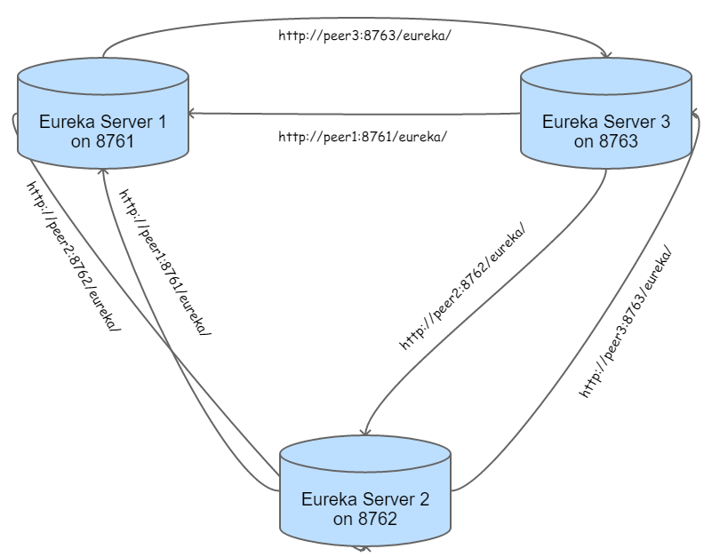

# Eureka Server(微服務的註冊及監管之伺服器)
* 微服務註冊表：Eureka Server會保存一份系統叢集中所有微服務的註冊名單。
* 微服務註冊：當每一個微服務啟動時，它們就是Eureka Client，它們會向Eureka Server註冊自己這個服務。
* 微服務發現：是指可以向Eureka Server查詢所有微服務以及它們各自的instance(Process)之資訊的功能。
* 微服務檢查：Eureka Server每隔一段時間會檢查系統叢集中的各微服務狀態，如果某個微服務之instance(Process)長期無法訪問(Heart beat fail)時，它會從自己的服務列表中移除該instance(Process)。
* 微服務伺服器的HA：可以開啟多台Eureka Server(Port Number需不同)，它們相互的定期sync對方的微服務註冊表，所以若當中一台Eureka Server當機，所有微服務會自動轉向另一台Eureka Server。

下圖為我們導入Eureka Server後，整個叢集式Eureka Server的HA之觀念：

src/main/java/com.netpro.trinity.dis這個package存放主程式進入點-MicroserviceCloudServer.java
src/main/resources這裡存放Eureka Server的設定檔